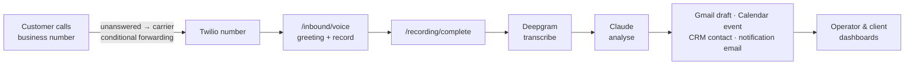

# Aida

Multi-tenant **call capture and follow-up** for small businesses. When a
customer's call goes unanswered, it's routed to a Twilio number, recorded, and
turned into structured follow-up: a transcript (Deepgram), an AI analysis
(Claude), a CRM contact, a drafted follow-up email and calendar event (Gmail /
Google Calendar), and a notification to the business owner.

> **Full documentation starts at [`docs/INDEX.md`](docs/INDEX.md).** This README
> is a short orientation; the index links every operational, security, and
> architecture document.

---

## How it works (current system)



- Customers keep calling the business's existing number. The client sets up
  **conditional** call forwarding (`**61*` / `**62*` / `**67*`) so only
  unanswered/busy/unreachable calls reach Aida — see
  [`CLIENT_ONBOARDING_RUNBOOK.md`](CLIENT_ONBOARDING_RUNBOOK.md).
- The whole recording→follow-up pipeline is described in
  [`docs/ARCHITECTURE.md`](docs/ARCHITECTURE.md).

Two future capabilities are **designed but not built**: capturing *answered*
calls ([`docs/VOIP_V2_ARCHITECTURE.md`](docs/VOIP_V2_ARCHITECTURE.md)) and an
outbound AI BDM ([`docs/OUTBOUND_BDM_ARCHITECTURE.md`](docs/OUTBOUND_BDM_ARCHITECTURE.md)).

## Tech stack

Node.js / Express · Twilio Programmable Voice · Deepgram · Anthropic Claude ·
Supabase (Postgres + Auth + Storage) · Google (Gmail + Calendar) · hosted on
Railway. Frontend is static HTML/JS in `public/`.

## Quick start (local dev)

```bash
npm install
cp .env.example .env        # then fill in — see DEPLOYMENT.md for each var
npm run dev                 # nodemon on http://localhost:3000
```

For Twilio to reach local webhooks during development, expose the port (e.g.
`ngrok http 3000`) and set `BASE_URL` to the public URL.

- **Environment variables:** [`DEPLOYMENT.md`](DEPLOYMENT.md) (authoritative) and
  [`.env.example`](.env.example). The app **fails closed** at startup if a
  critical secret (`SUPABASE_URL`, `SUPABASE_SERVICE_KEY`, `SESSION_SECRET`,
  `ENCRYPTION_KEY` ≥ 32 chars) is missing.
- **Deploy:** [`PRODUCTION_ROLLOUT.md`](PRODUCTION_ROLLOUT.md).

## Testing

```bash
npm run smoke:preflight     # env / config check, no server needed
npm test                    # == npm run smoke — black-box HTTP checks
```

Point the suite at any instance with `SMOKE_BASE_URL`; see
[`smoke/README.md`](smoke/README.md). Live phone-call verification is manual —
[`smoke/MANUAL_CHECKLIST.md`](smoke/MANUAL_CHECKLIST.md).

## Repository layout

| Path | What |
|---|---|
| `src/routes/` | HTTP routes (Twilio webhooks, dashboards, auth) |
| `src/services/` | Pipeline + integrations (transcribe, analyse, contacts, Google, tokens) |
| `src/middleware/auth.js` | Operator + client authentication |
| `src/config/` | Startup config validation |
| `public/` | Dashboards + onboarding (static) |
| `smoke/` | Automated smoke-test suite |
| `docs/` | Architecture, plans, and the documentation index |
| `supabase/sql/` | RLS + migration scripts (reviewed, applied manually) |

## Contributing / operations

- Documentation index & roadmap: [`docs/INDEX.md`](docs/INDEX.md)
- Current architecture: [`docs/ARCHITECTURE.md`](docs/ARCHITECTURE.md)
- Security posture: [`SECURITY_REVIEW.md`](SECURITY_REVIEW.md)
- Engineering backlog: [`docs/ENGINEERING_BACKLOG.md`](docs/ENGINEERING_BACKLOG.md)
- Incident playbooks: [`INCIDENT_RESPONSE.md`](INCIDENT_RESPONSE.md)
