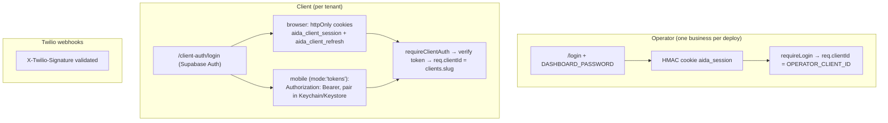

# Aida — Current System Architecture

_The canonical description of how Aida works **today** (commit `1cdeaaa`). This is
the "as-built" reference; designs for future capabilities live in
[VOIP_V2_ARCHITECTURE.md](VOIP_V2_ARCHITECTURE.md) and
[OUTBOUND_BDM_ARCHITECTURE.md](OUTBOUND_BDM_ARCHITECTURE.md)._

> ⚠️ The root [../README.md](../README.md) is **obsolete** — it describes an older
> SMS-transcript / UK-number MVP. This document supersedes it for the current
> system. See [DOCS_AUDIT.md](DOCS_AUDIT.md).

---

## 1. What it does

Aida is a multi-tenant Node/Express service. For each small-business client it:

1. Receives **missed/unanswered** inbound calls (routed to a Twilio number via the
   client's carrier **conditional** call-forwarding).
2. Plays a voicemail greeting and records the caller's message.
3. Transcribes it (Deepgram), analyses it (Claude) into structured data.
4. Drives follow-up: a Gmail draft to the caller, a Calendar event if a
   time was agreed, a CRM contact record, and a notification email to the operator.
5. Presents everything in two dashboards — an **operator** dashboard (single
   business) and a **client** dashboard (per-tenant contacts view).

The unit of tenancy is a **client** (a `clients` row) identified by a **slug**.

## 2. Tech stack

| Layer | Choice |
|---|---|
| Runtime | Node.js (18+), Express 4, CommonJS |
| Telephony | Twilio Programmable Voice (webhooks + TwiML) |
| Transcription | Deepgram (nova-2, diarised) |
| AI analysis | Anthropic Claude (Haiku) via REST |
| Data / auth / storage | Supabase (Postgres, Auth, Storage) |
| Email / calendar | Google (Gmail + Calendar) via OAuth per client |
| Hosting | Railway |
| Frontend | Static HTML + vanilla JS in `public/` |

## 3. Request surface (routes)

Mounted in `src/server.js`. Auth column: **Twilio sig** = webhook signature
validated; **operator** = `requireLogin`; **client** = `requireClientAuth`;
**public** = none.

| Mount | File | Auth | Role |
|---|---|---|---|
| `/inbound` | routes/inbound.js | Twilio sig | Incoming call webhook → voicemail record, or outbound-bridge for the owner |
| `/outbound` | routes/outbound.js | Twilio sig | 🟡 Legacy UK-hardcoded bridge (superseded by inbound's bridge path) |
| `/recording` | routes/recording.js | Twilio sig | Recording-complete webhook → **the pipeline** |
| `/call` | routes/call.js | operator | Operator-initiated outbound call |
| `/calls` | routes/calls.js | operator | Dashboard calls list + field-whitelisted PATCH |
| `/auth` | routes/auth.js | mixed | Google OAuth connect/status/disconnect (`/google/callback` public) |
| `/settings` | routes/settings.js | operator | Pipeline on/off toggle |
| `/voicemail` | routes/voicemail.js | operator | Greeting upload/status/delete |
| `/personal-contacts` | routes/personal-contacts.js | operator | Personal-number exclusion list |
| `/test` | routes/test.js | operator | Dev-only pipeline injection |
| `/login` | routes/login.js | public | Operator password login |
| `/client-auth` | routes/client-auth.js | public (`/me` client) | Client signup (invite-gated) / login / refresh / logout / `GET /me` / invite mint (operator) — dual transport, see [MOBILE_API_CONTRACT.md](MOBILE_API_CONTRACT.md) |
| `/client-dashboard` | routes/client-dashboard.js | client | Per-tenant contacts API |
| `/locksmith-receptionist` | routes/locksmith.js | public | AIDA Locksmith Receptionist product page + pilot enquiry POST. **Dormant**: 404s unless `LOCKSMITH_PILOT_ENABLED="true"`. Reads config + demo data only — no tenant data, no pipeline contact; submissions separately off with no persistence sink. See [LOCKSMITH_PILOT_SPEC.md](LOCKSMITH_PILOT_SPEC.md) |
| `/client/locksmith-onboarding/:sessionId/*` | routes/locksmith-onboarding.js | client | Locksmith onboarding review + approval (M2). **Dormant**: 404s unless `LOCKSMITH_ONBOARDING_ENABLED="true"`. See [LOCKSMITH_ONBOARDING_SPEC.md](LOCKSMITH_ONBOARDING_SPEC.md) |
| `/locksmith-founder/*` | routes/locksmith-onboarding.js | operator | Founder console for onboarding sessions (M2) + the only transcript-ingestion entry point. Dormant with the same flag; cannot approve on a client's behalf |
| `/locksmith-founder/provisioning/*` | routes/locksmith-onboarding.js | operator | Retell provisioning preview, dry-run and mock execution (M3). Dormant with the onboarding flag; live execution is hidden unless every Retell gate passes |
| `/client/locksmith` | routes/locksmith-portal.js | client | Locksmith client portal (M5), 7 server-rendered tabs + change-request, notification and forwarding POSTs. **Dormant**: 404s unless `LOCKSMITH_PORTAL_ENABLED="true"` — a flag deliberately independent of the public-page flag. Reads `calls` with a STRICT tenant scope (no legacy `default`/NULL widening). See [LOCKSMITH_CLIENT_PORTAL_SPEC.md](LOCKSMITH_CLIENT_PORTAL_SPEC.md) |
| `/locksmith-founder/clients[/:clientId]` | routes/locksmith-portal.js | operator | Client-operations view (M5). Cross-tenant reads, GET-only by design: there is no operator path that approves a client's change or alters their receptionist |
| `/webhooks/retell` | routes/retell-webhook.js | signature | Retell event webhook (M3). **Dormant**: 404s unless `RETELL_ENABLED` and `RETELL_WEBHOOK_ENABLED` are both `"true"`. Mounted with its own `express.raw` parser so signature verification sees the exact bytes. See [RETELL_INTEGRATION_SPEC.md](RETELL_INTEGRATION_SPEC.md) |
| `/health` | inline | public | Liveness probe |

## 4. The pipeline (the core value path)

Every recording — whether a v1 voicemail or a future v2 answered call — flows
through `POST /recording/complete` in `routes/recording.js`. This is the contract
future work must preserve.

```mermaid
sequenceDiagram
    participant C as Caller
    participant Tw as Twilio
    participant IB as /inbound/voice
    participant DB as Supabase
    participant RC as /recording/complete
    participant DG as Deepgram
    participant CL as Claude
    participant G as Google (Gmail/Cal)

    C->>Tw: calls business number (unanswered → forwarded)
    Tw->>IB: POST /inbound/voice (To = Twilio #)
    IB->>DB: resolve client by twilio_number; insert calls row
    IB->>Tw: TwiML: play greeting + <Record>
    C->>Tw: leaves message
    Tw->>RC: POST /recording/complete (RecordingUrl, CallSid)
    RC->>DB: claim_recording (idempotency) + save recording_url
    RC->>DG: transcribe audio
    RC->>DB: pipeline paused? personal contact? (skip if so)
    RC->>CL: analyse transcript (+ contact history + business profile)
    RC->>DB: upsert call, update contact, maybe regen business profile
    RC->>G: create Gmail draft (if caller email) + Calendar event (if date)
    RC->>G: send notification email to operator
```

Key robustness properties already in place:
- **Idempotency:** `claim_recording` RPC ensures only the first delivery of a
  recording proceeds (blocks Twilio retries / replays).
- **Fail-soft:** each pipeline step is independently `try/caught`; a failure in
  drafting/calendar/notify never loses the saved call.
- **Recovery:** `recording_url` is persisted immediately, so a crashed pipeline is
  replayable.
- **Pipeline pause:** if the client toggled Aida off, the call is logged but not
  processed (saves Deepgram/Claude cost).
- **Personal-contact filter:** calls from numbers on the personal list are logged
  but skip AI/drafts/notification.

## 5. Services

Each service takes `clientId` explicitly and scopes every query — the data layer
is already multi-tenant.

| Service | Responsibility |
|---|---|
| `supabase.js` | The single service-role client (hardened: no session persistence) |
| `transcribe.js` | Deepgram call → speaker-labelled transcript |
| `analyse.js` | Claude → structured `{caller, intent, summary, facts, follow_up}` |
| `contacts.js` | Get/create/update contacts; rolling context summary; list for dashboard |
| `business-profile.js` | Infer industry/business type from transcripts; drive extraction fields |
| `personal-filter.js` | Personal-number exclusion checks + list management |
| `gmail.js` / `gcal.js` / `notify.js` | Google token refresh + draft/event/notification (⚠️ token-refresh logic is triplicated — see [ENGINEERING_BACKLOG.md](ENGINEERING_BACKLOG.md)) |
| `token.js` | AES-256-GCM encryption of stored OAuth tokens |
| `client-auth.js` | Supabase signup (admin API) / login (throwaway client) |
| `invite.js` | HMAC-signed, expiring, single-use signup invite tokens |
| `clients.js` | Resolve client by Twilio number |
| `sms.js` | 🔴 Dead code (no imports) |

## 6. Data model

Postgres tables in Supabase (inferred from code — this table is the source of
truth until a schema file exists). All tenant tables scope by `client_id` (the
slug).

| Table | Key columns | Notes |
|---|---|---|
| `clients` | `slug` (PK-ish), `name`, `twilio_number`, `real_number`, `timezone`, `pipeline_enabled`, `auth_user_id` | Tenant registry; `auth_user_id` links to Supabase Auth |
| `calls` | `call_sid`, `client_id`, `direction`, `status`, `recording_url`, `recording_sid`, `from_number`, `to_number`, `duration`, `transcript`, `analysis`, `caller_*`, `intent`, `summary`, `crm_verified`, `crm_notes`, `instruction`, `recorded_at` | The call record; dashboard reads/writes a whitelisted subset |
| `contacts` | `client_id`, `phone`, `name`, `email`, `company`, `facts` (jsonb), `call_count`, `context_summary`, `last_seen` | CRM; enriched per call |
| `client_settings` | `client_id`, `pipeline_enabled`, `voicemail_url`, `voicemail_updated_at` | Per-client toggles + greeting |
| `personal_contacts` | `client_id`, `phone`, `label` | Exclusion list |
| `business_profiles` | `client_id`, `industry`, `business_type`, `profile_summary`, `common_intents`, `extraction_fields` (jsonb), `call_count_at_generation` | Inferred business intelligence |
| `connections` | `client_id`, `provider`, `access_token` (enc), `refresh_token` (enc), `token_expiry`, `email` | Google OAuth tokens, encrypted |

Also: RPC `claim_recording(p_call_sid, p_recording_sid)`; Storage bucket
`voicemail-greetings`. **RLS is currently disabled** on these tables (see
[../SECURITY_REVIEW.md](../SECURITY_REVIEW.md) and
[../supabase/sql/RLS_APPLY_CHECKLIST.md](../supabase/sql/RLS_APPLY_CHECKLIST.md)).

### Locksmith pilot tables (written, **none applied**)

All are additive, enable RLS in the same transaction with no policies
(service_role only), and are inert while their feature flags are off. Apply in
file order; each references the one before it.

| Migration | Tables | Spec |
|---|---|---|
| `lpm2_create_locksmith_onboarding.sql` | `locksmith_onboarding_sessions`, `locksmith_profile_versions` | [M2](LOCKSMITH_ONBOARDING_SPEC.md) |
| `lpm3_create_retell_provisioning.sql` | provider resources + provisioning plans | [M3](RETELL_INTEGRATION_SPEC.md) |
| `lpm4_create_onboarding_call_runtime.sql` | `onboarding_call_consents`, `onboarding_calls` | [M4](LOCKSMITH_ONBOARDING_RUNTIME_SPEC.md) |
| `lpm5_create_client_portal.sql` | `locksmith_change_requests`, `locksmith_notification_settings`, `locksmith_call_forwarding` | [M5](LOCKSMITH_CLIENT_PORTAL_SPEC.md) |

The portal adds **no** call or enquiry table: its call and enquiry lists are
projections over the existing `calls` table, so there is exactly one count of
any given call — including the one billing will use.

## 7. Authentication model

Two independent auth systems — detail in [../SECURITY_REVIEW.md](../SECURITY_REVIEW.md).



`req.clientId` is always resolved server-side, never from request input.

Client auth is **dual-transport, single-implementation**: browser cookie mode
(with transparent B1 refresh) and mobile Bearer mode share one middleware and
one validation/refresh path. A request carrying any `Authorization` header is
bearer-mode and its cookies are ignored — never a silent fallback. Full
contract: [MOBILE_API_CONTRACT.md](MOBILE_API_CONTRACT.md).

## 8. External dependencies & failure surface

| Dependency | Used for | If it's down |
|---|---|---|
| Twilio | Calls, recording, webhooks | No calls captured; carrier-level failure to caller |
| Supabase | All data, auth, storage | Pipeline + dashboards fail; see INCIDENT_RESPONSE |
| Deepgram | Transcription | Pipeline stops after recording (recording preserved) |
| Anthropic | Analysis, drafts, summaries | Call still saved; automation skipped |
| Google | Drafts, calendar, notifications | Call saved; follow-up degrades to none |
| Railway | Hosting | Whole app down |

## 9. Known constraints & transitional state

- `OPERATOR_CLIENT_ID=default` — the operator dashboard manages one tenant; legacy
  data lives under the `'default'` slug. See [../DEPLOYMENT.md](../DEPLOYMENT.md).
- `routes/calls.js` carries a **transitional tenant filter** (`clientId OR 'default'
  OR NULL`) so legacy rows stay visible until the Phase 5 backfill.
- RLS disabled (Phase 2 pending).
- Client dashboard sessions expire ~1h (refresh token discarded — Phase 5 item 5).
- `outbound.js` (UK bridge) and `sms.js` (dead) are cruft pending removal.

See [../PHASE_5_PLAN.md](../PHASE_5_PLAN.md) and
[ENGINEERING_BACKLOG.md](ENGINEERING_BACKLOG.md) for the remediation plan.
