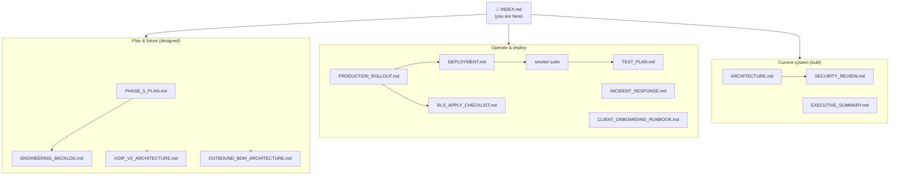
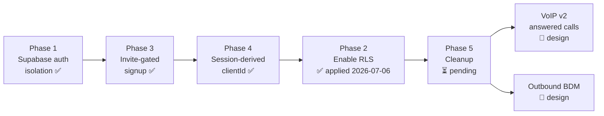

# Aida — Documentation Index

**This is the single source of truth for Aida's documentation.** Every document
in the repo is catalogued here, grouped by purpose, with its status and who owns
which facts. Start here.

> **What is Aida?** A per-tenant service that captures phone calls for small
> businesses — records them via Twilio, transcribes (Deepgram), analyses (Claude),
> and drives follow-up (Gmail drafts, Calendar events, CRM contacts, notification
> emails). Today it captures **missed/voicemail** calls (inbound) via carrier
> conditional forwarding. Two major capabilities are designed but not built:
> **VoIP v2** (capture *answered* calls) and the **Outbound AI BDM**.

---

## Reading paths (start by what you're doing)

| I want to… | Read, in order |
|---|---|
| **Understand the current system** | [ARCHITECTURE.md](ARCHITECTURE.md) → [../SECURITY_REVIEW.md](../SECURITY_REVIEW.md) |
| **Deploy a change** | [../PRODUCTION_ROLLOUT.md](../PRODUCTION_ROLLOUT.md) → [../DEPLOYMENT.md](../DEPLOYMENT.md) → run `npm run smoke` ([../smoke/README.md](../smoke/README.md)) → [../TEST_PLAN.md](../TEST_PLAN.md) |
| **Apply RLS** | [../supabase/sql/RLS_APPLY_CHECKLIST.md](../supabase/sql/RLS_APPLY_CHECKLIST.md) |
| **Onboard a pilot client** | [../CLIENT_ONBOARDING_RUNBOOK.md](../CLIENT_ONBOARDING_RUNBOOK.md) |
| **Fix something that broke** | [../INCIDENT_RESPONSE.md](../INCIDENT_RESPONSE.md) |
| **Get the executive picture** | [../EXECUTIVE_SUMMARY.md](../EXECUTIVE_SUMMARY.md) |
| **Plan the next engineering work** | [ENGINEERING_BACKLOG.md](ENGINEERING_BACKLOG.md) → [../PHASE_5_PLAN.md](../PHASE_5_PLAN.md) |
| **Build VoIP v2** | [VOIP_V2_IMPLEMENTATION_PLAN.md](VOIP_V2_IMPLEMENTATION_PLAN.md) → [VOIP_V2_ARCHITECTURE.md](VOIP_V2_ARCHITECTURE.md) → [VOIP_V2_BACKEND_SPEC.md](VOIP_V2_BACKEND_SPEC.md) / [VOIP_V2_MOBILE_APP_SPEC.md](VOIP_V2_MOBILE_APP_SPEC.md) → [VOIP_V2_PRODUCTION_OPS.md](VOIP_V2_PRODUCTION_OPS.md) |
| **Build the mobile app against the API** | [MOBILE_API_CONTRACT.md](MOBILE_API_CONTRACT.md) → [VOIP_V2_MOBILE_APP_SPEC.md](VOIP_V2_MOBILE_APP_SPEC.md) |
| **Build the outbound BDM** | [OUTBOUND_BDM_ARCHITECTURE.md](OUTBOUND_BDM_ARCHITECTURE.md) → [OUTBOUND_BDM_COMPLIANCE_ENGINE.md](OUTBOUND_BDM_COMPLIANCE_ENGINE.md) |
| **Work on locksmith prospect acquisition** | [OUTBOUND_BDM_ARCHITECTURE.md](OUTBOUND_BDM_ARCHITECTURE.md) (the law and the gates) → [LOCKSMITH_ACQUISITION_SPEC.md](LOCKSMITH_ACQUISITION_SPEC.md) (what was built) → [ACQUISITION_SQL_RUNBOOK.md](ACQUISITION_SQL_RUNBOOK.md) (applying its schema) |
| **Audit the docs themselves** | [DOCS_AUDIT.md](DOCS_AUDIT.md) |
| **Do engineering work in this repo (any kind)** | [../.claude/skills/aida-orchestrate/SKILL.md](../.claude/skills/aida-orchestrate/SKILL.md) — the engineering operating system (workflow, delegation, verification, safety boundaries) |

---

## Document catalogue

Status legend: ✅ current · 🟡 partially superseded (see audit) · 🔴 obsolete · 📐 design (not built) · 🧭 index

### Architecture & product
| Doc | Status | Purpose | Owns (source of truth for) |
|---|---|---|---|
| [ARCHITECTURE.md](ARCHITECTURE.md) | ✅ | How the current system works end-to-end: routes, services, data model, pipeline | Current system structure, data model |
| [LOCKSMITH_PILOT_SPEC.md](LOCKSMITH_PILOT_SPEC.md) | ✅📐 | **AIDA Locksmith Receptionist** (Niche Drops) — M1 public product shell at `/locksmith-receptionist`: page sections, config/flags, demo-data boundary, stubbed enquiry submission, mobile + a11y review, founder placeholders. Built dormant, not deployed | Locksmith pilot product scope, config, demo-data rules, enquiry-form status |
| [LOCKSMITH_CLIENT_PORTAL_SPEC.md](LOCKSMITH_CLIENT_PORTAL_SPEC.md) | ✅📐 | **M5 client portal + configuration management** — authenticated portal at `/client/locksmith` (7 tabs), channel-neutral change-request domain shared by UI and the future voice configuration agent, layered voice-auth policy, notification preferences with cost visibility, call-forwarding journey over the verified divert-codes module, founder client-operations view, nine read models. Built dormant; SQL written, **not applied**; no configuration call placed, no agent number connected | Client portal surfaces, change-request domain, UI/voice configuration parity, notification preferences, call-forwarding journey, portal read models |
| [LOCKSMITH_ONBOARDING_RUNTIME_SPEC.md](LOCKSMITH_ONBOARDING_RUNTIME_SPEC.md) | ✅📐 | **M4 autonomous onboarding call runtime** — call consent, client call page, start-call service, lifecycle ingestion, transcript→review automation, approval→provisioning bridge, mock end-to-end simulator, generated receptionist test plan, Micro complexity assessment. Built dormant and **uncommitted**; SQL written, **not applied**; no call placed | Onboarding call consent, call lifecycle, transcript automation, provisioning bridge, mock simulator |
| [RETELL_INTEGRATION_SPEC.md](RETELL_INTEGRATION_SPEC.md) | ✅📐 | **M3 Retell provider + provisioning foundation** — official docs reviewed, SDK/transport decision, four danger gates, provider-neutral port and adapters, receptionist + onboarding-agent compilers, post-call analysis, provisioning plan lifecycle, resource registry, webhook signature architecture, founder preview. Built dormant; SQL written, **not applied**; no external resource created | Retell integration boundary, provider port, compilers, provisioning plan, webhook verification |
| [LOCKSMITH_ONBOARDING_SPEC.md](LOCKSMITH_ONBOARDING_SPEC.md) | ✅📐 | **M2 autonomous onboarding foundation** — canonical locksmith business profile (12 sections), profile + session lifecycles, transcript ingestion boundary, extraction adapter contract, review/approval experience, founder console, provisioning-readiness rules, Retell webhook signature requirement. Built dormant; SQL written, **not applied** | Canonical profile schema, profile/session lifecycles, extraction contract, approval guard, provisioning readiness |
| [LOCKSMITH_ACQUISITION_SPEC.md](LOCKSMITH_ACQUISITION_SPEC.md) | ✅📐 | **The acquisition engine (A1 · A2 · M8B · M8C · M8E · M8F · M8G · M8H · M8I · M8J)** — the hardcoded offline boundary (no crawler, no search/directory/DNCR API, enforced in config, registry and schema), acquisition vocabulary, official-source classification, append-only evidence ledger, append-only hash-chained decision log (G17), prospect lifecycle whitelist incl. the M8B engagement states and remediation gates, discovery adapter contract + two deterministic fixtures, human review, phone normalisation, deduplication, explainable qualification (facts vs inferences; unknown never scores; bigger is not worse), the unified eligibility gate, permanent suppression, founder batch approval, the **dormant** call queue (leases, idempotency, eligibility re-run at selection), contact outcomes, the founder read model, and **durable state** (store contract + in-memory and lazy-Supabase adapters, hydrated suppression, atomic leases, restart-safe idempotency, a dormant lease reaper, fail-closed outcome ordering, a process-restart proof, and the **final pre-dial authorisation gate** whose durable suppression read closes M-7 — the hydrated index may reject cheaply, but only an authoritative read may authorise), and **real-source CSV lead intake** (Outscraper/Google-Maps and hand-curated profiles, unknown-stays-unknown mapping, landlines retained because AIDA is voice-first, explainable dedupe and locksmith/aggregator classification, dry-run-by-default CLI). **Imported prospects persist** to the applied laq1 tables under an explicit `--write` (M8G): prospect → phones → evidence, idempotent on prospect_id / unique(prospect_id,raw) / evidence content_hash, so a re-import merges instead of multiplying and a possible duplicate is held for a human rather than stored. **A durable review queue** (M8H) keeps ambiguous candidates as append-only decision-log events a founder resolves later, and a conclusive merge now attaches genuinely new phones and evidence to the canonical business additively, without upgrading source authority; and the decision chain is now **safe for concurrent writers** (M8I): `laq3` puts `unique (prev_hash)` on `acquisition_decisions`, so a fork is structurally impossible rather than merely discouraged, the loser of a race is refused `head_taken` and re-mints against the new head under a bounded retry, and the head is read authoritatively instead of off the end of a capped page. **M8J closed the two undocumented first-call blockers**: a persisted prospect can now durably reach `review_approved` via a compare-and-set lifecycle projection of the durable review decision (E-2 — before this nothing wrote the column and every persisted prospect was permanently `discovered`), and attempt history is derived from `acquisition_contact_outcomes` by one authoritative path that the final gate reads every time and fails closed on (E-1). **A-L6 / A-L7 / A-L8 are now CLOSED — the founder approved the attempt policy on 2026-08-10 (2 counted attempts, 2 days apart; a no-answer does not consume one and a voicemail does; not_interested and declined are permanent no-recontact rather than cooldowns, and are never recorded as opt-outs; a requested callback is honoured 14 days; the generic 30-day cooldown is retired), which needed no SQL because the permanence is a predicate over rows already stored**, with the counting isolated in the attempt policy so either answer works against the same stored rows. Built dormant; `laq1` + `laq2` **applied to dev (M8D)** and `laq3` **applied to dev (M8I)**, **none to production**; no site crawled, no external API called, no call placed. **M8K built durable DNCR wash storage (E-3) offline**: an append-only ledger storing wash EVENTS rather than a boolean, so freshness is recomputed at read time and an expired wash decays to `unknown` rather than to its last answer; hydrated at the async boundary so `assess()` stays synchronous; canonical number keys, idempotent import, newest-**performed** wash wins, and a fail-closed `dncr_store_unavailable` kept distinct from "never checked", because an empty Map read as success is indistinguishable from "nobody is on the Register". **`laq4` applied to dev 2026-08-10, not to production**, and **E-3 is CLOSED ON DEV, proven restart-safe**: two genuinely separate OS processes read the same persisted wash and gave the same answer, and the *same row* at +42 days decays to `unknown` and refuses with `dncr_wash_stale` without any row changing — 33 read-only checks, zero residue. Dev now holds **21 fictional rows across nine tables**, M8K's contribution being exactly one wash row that is fictional and attested by a verification probe rather than by anybody who washed a real list. **DNCR-1** — who holds the account and may attest a real wash — remains open, official-export mapping is pending a real sample, and nothing here can contact the Register. **M8M replaced the counsel gate with a versioned FOUNDER OPERATING POLICY (§46)**: A-L1 and A-L3 are closed by founder decision — AI voice acquisition calls are operated as telemarketing calls under the published Australian calling-hours framework, Mon–Fri 09:00–20:00 / Sat 09:00–17:00 / no Sunday recipient-local (unchanged and now ratcheted at every boundary), and **no cold call on an applicable public holiday**, the conservative option. `counselApproved` is GONE rather than renamed, so the retired boolean authorises nothing; `kind` and `isLegalAdvice: false` are not parameters, so no artifact can claim a lawyer reviewed it, and **none has**. Crucially the POLICY closing did not close the DATA: **A-L2 stays open** — the holiday calendar is still a hand-compiled, non-authoritative, 2026-only fixture that refuses every date from 2027-01-01. **E-5 closed founder batch approval with NO SQL (§44)**: an approval is now an append-only `acquisition_decisions` row whose `entity_id` is `ba_<membershipHash>` **derived from the membership itself**, so a changed batch is a different entity that no replayed approval can reach; `entity_type` has admitted `'batch'` since laq1 and `unique (prev_hash)` already serialised writers, so nothing needed altering. The M8E gate **destructures `context.batch` off the caller's context and discards it** — `{ approved: true }` was assertable by anything until now — and reads the approval durably or refuses; an unreadable store is `batch_approval_store_unavailable`, never "not approved". The durable hash covers **who and on what number only**, deliberately NOT eligibility, so an expiring wash or an arriving suppression makes the prospect ineligible **without** faking batch staleness — the two are separately reported. `maxBatchSize: 25` is now enforced rather than merely configured, and **A-L9 is untouched**: one named human approver, no second-approver role, no automatic or AI approval, each pinned by a ratchet. Proven across two genuinely separate OS processes (9/9 and 26/26) against a file-backed store, **zero database residue**, and **no approval has ever been written to dev or production**. **M8L closed the last caller-supplied trust input, also with NO SQL (§45)**: duplicate resolution now comes from the **M8H review decisions** already in `acquisition_decisions` — open means unresolved, `merge_into_existing` means the canonical business is the only callable identity, a rejection means not callable at all — so no new event, table or column was needed and no second truth source was created. The M8E gate destructures `context.duplicateResolution` off the caller’s context and discards it, which matters because `resolveDuplicates([oneProspect])` is a *valid* resolution in which nothing can be a duplicate of anything, and it is what every dry run and proof actually built. A prospect with no review item is cleared only if a **stored row** exists; one that lives only in a caller’s memory is refused `duplicate_never_assessed`, and an unreadable store is `duplicate_resolution_store_unavailable` rather than “no duplicate known”. Proven across two separate OS processes (13/13 and 22/22), **zero database residue**; `node scripts/acquisition-review.js duplicates` is the read-only founder view. **E-7A built the provider-disabled dial execution seam (§47), with NO SQL**: the M8E slip is now authenticated by **identity rather than by its brand** — a spread clone carried the exported symbol and was not frozen, so a copy could have been pointed at a different number, and `isGenuineAuthorisedDial` closes that before anything existed to spend a slip on. One execution entry point consumes a genuine slip **at most once** (claimed synchronously, so ten concurrent attempts yield one submission), refuses it after **60 seconds**, rejects any caller-supplied destination or compliance answer outright, re-reads the kill switch immediately before dispatch, **never retries** an ambiguous provider failure, and **records no contact outcome and consumes no attempt**. The provider is handed a frozen `{executionId, destination, prospectId, businessName, authorisedAt, metadata}` and nothing it could reinterpret as permission. **Only two providers exist — a disabled one (the default) and an offline fake** — and ratchets assert no network, no credentials, no env var, and no provider declaring itself live. `node scripts/acquisition-dial-proof.js` prints DRY EXECUTION / NO CALL SENT. **E-7 remains OPEN**; single-consumption is process-local and a live adapter is **E-7B** | Offline boundary, acquisition vocabulary, source authority tiers, evidence ledger, decision log, prospect lifecycle, discovery contract, review step, qualification model, queue boundary, suppression semantics, outcome model, durable batch approval, durable duplicate resolution, dial execution seam |
| [ACQUISITION_SQL_RUNBOOK.md](ACQUISITION_SQL_RUNBOOK.md) | ✅📐 | **Applying LAQ1 + LAQ2 + LAQ3 to dev, by hand** — pre-flight, apply, verify, self-rolling-back probes for the one-live-lease index, suppression permanence and the no-foreign-key rule, a real-database restart proof, a two-process concurrency proof for the decision chain, and explicit rollback caveats. Nothing in the repo applies SQL and a test asserts it; **all four migrations are applied to dev (M8D, M8I, M8K), none to production**. Dev holds **21** fictional proof rows across nine tables from M8D/M8E/M8G/M8H/M8I plus M8K's one permanent wash row, including two unplanned M8G rows that append-only and RESTRICT correctly refused to delete. **E-5 needed no migration and added no row** (§12). **E-7A needed none either and applied none** (§14) — the dial execution seam is a pure function of the slip it is handed, and its single-consumption is deliberately in-process rather than a table implying a guarantee the code does not make; §14.3 states the exact `unique (authorisation_id)` schema **E-7B** will need, written down so it can be reviewed before it exists. Verification assets live in `supabase/sql/verification/` | Acquisition SQL application order, verification probes, rollback limits, decision-chain serialisation, why E-5/M8L/E-7A needed no SQL |
| [ACQUISITION_E7B1_DESIGN.md](ACQUISITION_E7B1_DESIGN.md) | ✅📐⏳ | **The durable dispatch authority and emergency stop — IMPLEMENTED OFFLINE, LAQ5 WRITTEN AND APPLIED NOWHERE.** Code is in and green; `supabase/sql/laq5_create_dispatch_authority.sql` has been run against neither dev nor production, dev is unchanged at 21 rows, and there is still no live provider. Audits `acquisition_call_queue` (a lease is not a dispatch, and its `on delete cascade` is wrong for a record that a business may have been rung) and every field on the M8E slip. **Corrects runbook §14.3**: `authorisation_id` is a sha256 of (prospect, number, instant, decision) that legitimately collides — E-7A's suite asserts the collision as a feature — so it cannot be a unique key; and uniqueness on it would only stop replay of one authorisation, not two workers each minting their own for the same business, which is the case that actually rings a phone twice and which `minDaysBetweenAttempts` cannot catch because neither worker has recorded an outcome yet. **Rev 2 then corrected rev 1 twice more.** The lock predicate is **`resolved_at`** — a durable *business* outcome or an operator adjudication — and **provider completion never releases it**, so a worker whose provider accepted still holds the prospect until a contact outcome is recorded. And a per-prospect lock is **not sufficient on its own**: `acquisition_prospect_phones` is `unique (prospect_id, raw)`, stores the number *as published* with no normalised `e164` column anywhere, and `resolveDuplicates` only compares records handed to it — so two separately-imported prospects sharing one handset were **both measured as authorised to the same number**, which a per-prospect lock cannot see. Proposes `acquisition_dial_executions` (`primary key (dispatch_id)` random per mint for replay, `unique (prospect_id) where resolved_at is null`, **and `unique (destination_e164) where resolved_at is null`** — the only normalised-E.164 uniqueness rule in the schema; immutable identity, terminal resolution, RESTRICT not CASCADE, `batch_key NOT NULL` proven by showing no authorised decision exists without a durable approval) and `acquisition_calling_state` (`scope text primary key check (scope = 'global')`, bootstrapped `paused`, self-sufficient attribution with a `revision` counter, where a missing row, a second row, an unreachable DB and any non-`enabled` value all BLOCK; audit ordering flips by direction so an audit failure can only ever leave calling **off**). Outcome→resolution needs **no RPC**: there are no cross-table transactions (the repo already says so at `acquisition-durable.js:302`), so the outcome is written first and the lock released second, making *lock released but outcome missing* unreachable. Kill-switch history reuses `acquisition_decisions` — `entity_type` already admits `campaign`/`system`, so **no SQL for the audit trail**. Atomic claim is a single INSERT the database arbitrates: CLAIMED / ALREADY_CLAIMED / CONFLICT / STORE_UNAVAILABLE, and only CLAIMED may dispatch. Crash and lost-response semantics are unchanged from E-7A — **the authorisation stays spent and nothing auto-retries**. Expected dev proof residue stated in advance: **21 → 23** | Proposed E-7B1 schema, dispatch-claim invariants, durable emergency stop, bootstrap safety |
| [ACQUISITION_BLOCKER_REGISTER.md](ACQUISITION_BLOCKER_REGISTER.md) | ✅📐 | **The ONE live list of what stands between a persisted prospect and one authorised outbound call** — compliance policy/data items (**A-L1 and A-L3 CLOSED 2026-08-10 by a FOUNDER OPERATING POLICY — explicitly not legal advice, and no lawyer has reviewed the calling rules in this repo**; A-L2 and A-L5 and DNCR-1 open), founder/commercial items (A-L4, A-L9, A-L10 open; A-L6, A-L7, A-L8 closed 2026-08-10), engineering items (M-4, M-5, E-7 open; M-1, M-2, M-3, M-7, E-1, E-2 closed, E-3 closed on dev, **E-5 and M8L closed with no SQL**), what is applied to dev versus production, why neither needed a migration, and the recomputed first-call readiness matrix — in which **gate 6 (duplicates) and gate 12 (founder batch approval) are now GREEN**, leaving one RED and it is **E-7**, the dialler. **E-7A (§10) built the dial execution SEAM on 2026-08-11 with NO SQL and NO live provider** — one execution entry point that accepts only a genuine M8E slip, spends it once, expires it after 60s, refuses caller-supplied destinations and compliance answers, never retries, records no contact, and reaches a provider that is **disabled by default**; a ratchet fails the build if any provider declares itself live. **Gate 14 stays RED and E-7 stays OPEN** — a seam that cannot dial is not a dialler. Records its own limitations: single-consumption is **process-local** (durable needs SQL, deferred to **E-7B**) and there is still **no durable kill switch**. **DNCR-1 remains the only blocker that stops a first call outright — account application submitted, activation + first real wash + attestation outstanding.** **Supersedes the blocker tables in the spec**, which are milestone snapshots | Current acquisition blockers, first-call readiness, dev-vs-production apply state |
| [../EXECUTIVE_SUMMARY.md](../EXECUTIVE_SUMMARY.md) | ✅ | One-page status: what was fixed, what's risky, what's next | Executive status |
| [../README.md](../README.md) | ✅ | Project orientation → points into `docs/` | Repo entry point |

### Operations
| Doc | Status | Purpose | Owns |
|---|---|---|---|
| [../PRODUCTION_ROLLOUT.md](../PRODUCTION_ROLLOUT.md) | ✅ | Ordered deploy sequence + rollback decision tree | Deploy procedure, rollback |
| [../DEPLOYMENT.md](../DEPLOYMENT.md) | ✅ | Env var reference, deploy order, current transitional state | **Env var reference** |
| [../TEST_PLAN.md](../TEST_PLAN.md) | 🟡 | Manual smoke steps (predates the automated suite) | Manual/e2e verification steps |
| [../smoke/README.md](../smoke/README.md) | ✅ | Automated smoke suite usage | `npm run smoke` |
| [../smoke/MANUAL_CHECKLIST.md](../smoke/MANUAL_CHECKLIST.md) | ✅ | Twilio / live-call checks the suite can't automate | Live-call verification |
| [../INCIDENT_RESPONSE.md](../INCIDENT_RESPONSE.md) | ✅ | Playbooks: dashboard / calls / Google / RLS failures | Incident playbooks |

### Security & compliance
| Doc | Status | Purpose | Owns |
|---|---|---|---|
| [../SECURITY_REVIEW.md](../SECURITY_REVIEW.md) | ✅ | Findings: fixed, open (ranked), accepted | **Security posture & risk register** |
| [../supabase/sql/RLS_APPLY_CHECKLIST.md](../supabase/sql/RLS_APPLY_CHECKLIST.md) | ✅ | Gated RLS application + negative proof | **RLS procedure** |
| [../supabase/sql/phase2_enable_rls.sql](../supabase/sql/phase2_enable_rls.sql) | ✅ | The RLS enable script — **applied 2026-07-06** (via an existence-guarded variant; `personal_contacts` didn't exist yet and was covered at creation instead) | RLS SQL |
| [../supabase/sql/phase5_backfill_default.sql](../supabase/sql/phase5_backfill_default.sql) | ✅📐 | The `'default'` tenant backfill (not yet applied) | Backfill SQL |
| [../supabase/sql/create_personal_contacts.sql](../supabase/sql/create_personal_contacts.sql) | ✅ | Creates the `personal_contacts` table with RLS (P1-6) — **applied 2026-07-06**, post-apply smoke green | personal_contacts schema |
| [LLM_PROMPT_CONTAMINATION_INVESTIGATION.md](LLM_PROMPT_CONTAMINATION_INVESTIGATION.md) | ✅ | Root cause of the hallucinated-draft incident: prompt-input map, feedback loops, fix architecture | LLM prompt provenance & grounding rules |
| [../supabase/sql/cleanup_test_contamination.sql](../supabase/sql/cleanup_test_contamination.sql) | ✅📐 | Purges cached test-fixture contamination from calls/profile/contacts (not yet applied) | Contamination cleanup SQL |
| [../supabase/sql/phase1a_add_voip_enabled.sql](../supabase/sql/phase1a_add_voip_enabled.sql) | ✅📐 | Adds `clients.voip_enabled` (D7 flag; loop-guard INV-1) — not yet applied | voip_enabled column SQL |
| [../supabase/sql/phase1b_create_devices.sql](../supabase/sql/phase1b_create_devices.sql) | ✅📐 | Creates the `devices` table with RLS-at-birth (D8) — not yet applied | devices schema |
| [../supabase/sql/phase1c_add_answered_via.sql](../supabase/sql/phase1c_add_answered_via.sql) | ✅📐 | Adds `calls.answered_via/dial_status/answered_at` (nullable, v2 bookkeeping) — not yet applied | calls v2 columns SQL |
| [../supabase/sql/dev/dev_minimal_schema.sql](../supabase/sql/dev/dev_minimal_schema.sql) | ✅ | **DEV-ONLY** minimal `clients` schema + `dev-client` seed for the local VoIP E2E stack (RLS same-transaction, no PII; never for production) — applied to the dev Supabase project 2026-07-12, followed in order by phase1a + phase1b | dev Supabase schema |
| [../supabase/sql/wcs1b_create_client_phone_routing_profiles.sql](../supabase/sql/wcs1b_create_client_phone_routing_profiles.sql) | ✅📐 | Creates `client_phone_routing_profiles` with RLS-at-birth (D8) for WEB-CALL-SETUP-1 — **not yet applied** | client_phone_routing_profiles schema |
| [../supabase/sql/dev/dev_add_twilio_number.sql](../supabase/sql/dev/dev_add_twilio_number.sql) | ✅📐 | **DEV-ONLY** addendum: adds `clients.twilio_number` + fake seed to the dev project (call-setup generate target) — **not yet applied** | dev twilio_number addendum |
| [../supabase/sql/lpm2_create_locksmith_onboarding.sql](../supabase/sql/lpm2_create_locksmith_onboarding.sql) | ✅📐 | Creates `locksmith_onboarding_sessions`, `locksmith_business_profiles` (versioned, one-approved-per-client partial unique index) and the append-only `locksmith_onboarding_events`, all with RLS-at-birth (D8) — **not yet applied** | Locksmith onboarding schema |
| [../supabase/sql/lpm3_create_retell_provisioning.sql](../supabase/sql/lpm3_create_retell_provisioning.sql) | ✅📐 | Creates `provider_resources`, `provisioning_plans`, `provisioning_actions` and `provider_webhook_events` with RLS-at-birth and partial unique indexes (one active resource per purpose, one active plan per client, one success per idempotency key) — **not yet applied; apply after lpm2** | Retell provisioning schema |
| [../supabase/sql/lpm4_create_onboarding_call_runtime.sql](../supabase/sql/lpm4_create_onboarding_call_runtime.sql) | ✅📐 | Creates `onboarding_call_consents` (affirmative-consent check constraints, number-bound, versioned disclosure) and `onboarding_calls` (unique provider-call binding, one active call per session) with RLS-at-birth — **not yet applied; apply after lpm3** | Onboarding call runtime schema |

### Onboarding
| Doc | Status | Purpose | Owns |
|---|---|---|---|
| [../CLIENT_ONBOARDING_RUNBOOK.md](../CLIENT_ONBOARDING_RUNBOOK.md) | ✅ | Manual pilot onboarding: Twilio, clients row, invite, forwarding codes | **Onboarding procedure** |

### Planning & future
| Doc | Status | Purpose | Owns |
|---|---|---|---|
| [../PHASE_5_PLAN.md](../PHASE_5_PLAN.md) | ✅ | Ordered cleanup backlog with dependencies | Phase 5 scope |
| [ENGINEERING_BACKLOG.md](ENGINEERING_BACKLOG.md) | ✅ | Prioritised tech-debt / tooling / scalability proposals | Engineering backlog |
| [VOIP_V2_ARCHITECTURE.md](VOIP_V2_ARCHITECTURE.md) | 📐 | Answered-call capture via Twilio Voice SDK + native app | VoIP v2 design (D1–D6, INV-1–6) |
| [VOIP_V2_IMPLEMENTATION_PLAN.md](VOIP_V2_IMPLEMENTATION_PLAN.md) | ✅ | Phases, gates, blocking prerequisites, decisions D7–D12 | VoIP v2 sequencing & decisions D7+ |
| [VOIP_V2_BACKEND_SPEC.md](VOIP_V2_BACKEND_SPEC.md) | 📐 | Route contracts, `devices` data model, guard semantics, env/config | VoIP v2 backend contracts |
| [VOIP_V2_MOBILE_APP_SPEC.md](VOIP_V2_MOBILE_APP_SPEC.md) | 📐 | App behaviour contract: lifecycle, platform obligations, failure UX | VoIP v2 app contracts |
| [MOBILE_API_CONTRACT.md](MOBILE_API_CONTRACT.md) | ✅ | Stable mobile API contract: dual-mode auth (cookie/Bearer), client-auth + VoIP endpoint shapes, token lifecycle | **Mobile API request/response contract & auth transport rules** |
| [PRE_REACT_NATIVE_REVIEW.md](PRE_REACT_NATIVE_REVIEW.md) | ✅ | Principal-engineer review before RN work: must/should/can-wait recommendations | **Pre-RN prioritisation** |
| [VOIP_V2_PHASE_0_SCAFFOLD.md](VOIP_V2_PHASE_0_SCAFFOLD.md) | ✅ | Inventory + safety argument for the dormant Phase 0 code | Phase 0 scaffold state |
| [VOIP_V2_PRODUCTION_OPS.md](VOIP_V2_PRODUCTION_OPS.md) | 📐 | VoIP cost model, quality SLOs, monitoring, scaling, push reliability | VoIP v2 ops |
| [WEB_CALL_SETUP_SPEC.md](WEB_CALL_SETUP_SPEC.md) | ✅📐 | WEB-CALL-SETUP-1: guided conditional-diversion setup (missed/busy/unreachable). WCS-1a pure template engine + status machine built dormant (`src/services/divert-codes.js`, imported by nothing); routes/SQL/UI designed only | Call-setup module contract, divert-code templates, setup status machine |
| [OUTBOUND_BDM_ARCHITECTURE.md](OUTBOUND_BDM_ARCHITECTURE.md) | 📐 | Outbound AI BDM strategy + Australian compliance | Outbound BDM design |
| [OUTBOUND_BDM_COMPLIANCE_ENGINE.md](OUTBOUND_BDM_COMPLIANCE_ENGINE.md) | 📐 | Reusable compliance-as-code engine (interfaces, gates, evidence) | Compliance engine design |

### Meta
| Doc | Status | Purpose |
|---|---|---|
| [INDEX.md](INDEX.md) | 🧭 | This file |
| [DOCS_AUDIT.md](DOCS_AUDIT.md) | ✅ | Duplicates, contradictions, gaps, merge recommendations |
| [../.claude/skills/aida-orchestrate/SKILL.md](../.claude/skills/aida-orchestrate/SKILL.md) | ✅ | **Engineering operating system** — binding workflow: phases, requirements ledger, model/delegation routing, browser & React Native verification, safety boundaries |

---

## Documentation hierarchy

---

## The roadmap — how the phases link together

Aida's work is organised as numbered phases. Phases 1–4 are shipped (commit
`1cdeaaa`); Phase 5 is the remaining cleanup; VoIP v2 and the BDM are the next
major products.

Note the ordering nuance (from SECURITY_REVIEW.md): Phase 2 (RLS) was
intentionally deferred until after the Phase 5 item that removed the browser's
direct Supabase access, because enabling RLS while the old dashboard was live
would have broken it. **Status: RLS was applied 2026-07-06** (deny-by-default,
no policies; `personal_contacts` created same day with RLS on) and the full
smoke suite passed against production afterwards (17/17 active checks).
Remaining sign-off: the anon-role negative proof from
[RLS_APPLY_CHECKLIST.md](../supabase/sql/RLS_APPLY_CHECKLIST.md).

---

## Single-source-of-truth rules

To stop the same fact drifting across documents, each fact has **one owner**;
everything else links to it rather than restating it.

| Fact | Owned by | Everyone else should… |
|---|---|---|
| Environment variables | `DEPLOYMENT.md` | link, not re-list |
| Deploy order & rollback | `PRODUCTION_ROLLOUT.md` | link |
| RLS procedure & anon-key/service-key rotation caveat | `RLS_APPLY_CHECKLIST.md` | link |
| Security risks (open/fixed/accepted) | `SECURITY_REVIEW.md` | link |
| Onboarding steps & forwarding codes | `CLIENT_ONBOARDING_RUNBOOK.md` | link |
| Current transitional state (`OPERATOR_CLIENT_ID=default`, transitional filter) | `DEPLOYMENT.md` | link |
| Data model / schema | `ARCHITECTURE.md` | link |

See [DOCS_AUDIT.md](DOCS_AUDIT.md) for where this is currently violated and the
plan to fix it.

---

_Maintenance: when you add a doc, add a row to the catalogue above and place it in
the hierarchy. When you change an owned fact, change it in the owning doc only._
