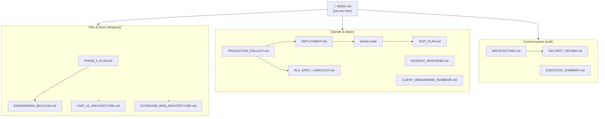
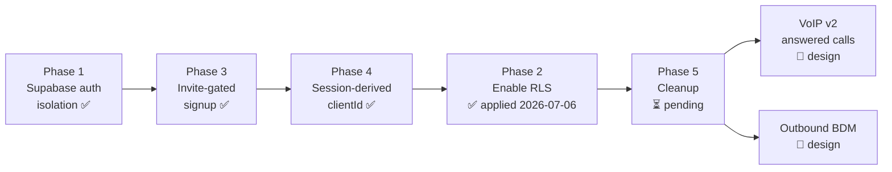

# Aida — Documentation Index

**This is the single source of truth for Aida's documentation.** Every document
in the repo is catalogued here, grouped by purpose, with its status and who owns
which facts. Start here.

> **What is Aida?** A per-tenant service that captures phone calls for small
> businesses — records them via Twilio, transcribes (Deepgram), analyses (Claude),
> and drives follow-up (Gmail drafts, Calendar events, CRM contacts, notification
> emails). Today it captures **missed/voicemail** calls (inbound) via carrier
> conditional forwarding. Two major capabilities are designed but not built:
> **VoIP v2** (capture *answered* calls) and the **Outbound AI BDM**.

---

## Reading paths (start by what you're doing)

| I want to… | Read, in order |
|---|---|
| **Understand the current system** | [ARCHITECTURE.md](ARCHITECTURE.md) → [../SECURITY_REVIEW.md](../SECURITY_REVIEW.md) |
| **Deploy a change** | [../PRODUCTION_ROLLOUT.md](../PRODUCTION_ROLLOUT.md) → [../DEPLOYMENT.md](../DEPLOYMENT.md) → run `npm run smoke` ([../smoke/README.md](../smoke/README.md)) → [../TEST_PLAN.md](../TEST_PLAN.md) |
| **Apply RLS** | [../supabase/sql/RLS_APPLY_CHECKLIST.md](../supabase/sql/RLS_APPLY_CHECKLIST.md) |
| **Onboard a pilot client** | [../CLIENT_ONBOARDING_RUNBOOK.md](../CLIENT_ONBOARDING_RUNBOOK.md) |
| **Fix something that broke** | [../INCIDENT_RESPONSE.md](../INCIDENT_RESPONSE.md) |
| **Get the executive picture** | [../EXECUTIVE_SUMMARY.md](../EXECUTIVE_SUMMARY.md) |
| **Plan the next engineering work** | [ENGINEERING_BACKLOG.md](ENGINEERING_BACKLOG.md) → [../PHASE_5_PLAN.md](../PHASE_5_PLAN.md) |
| **Build VoIP v2** | [VOIP_V2_IMPLEMENTATION_PLAN.md](VOIP_V2_IMPLEMENTATION_PLAN.md) → [VOIP_V2_ARCHITECTURE.md](VOIP_V2_ARCHITECTURE.md) → [VOIP_V2_BACKEND_SPEC.md](VOIP_V2_BACKEND_SPEC.md) / [VOIP_V2_MOBILE_APP_SPEC.md](VOIP_V2_MOBILE_APP_SPEC.md) → [VOIP_V2_PRODUCTION_OPS.md](VOIP_V2_PRODUCTION_OPS.md) |
| **Build the mobile app against the API** | [MOBILE_API_CONTRACT.md](MOBILE_API_CONTRACT.md) → [VOIP_V2_MOBILE_APP_SPEC.md](VOIP_V2_MOBILE_APP_SPEC.md) |
| **Build the outbound BDM** | [OUTBOUND_BDM_ARCHITECTURE.md](OUTBOUND_BDM_ARCHITECTURE.md) → [OUTBOUND_BDM_COMPLIANCE_ENGINE.md](OUTBOUND_BDM_COMPLIANCE_ENGINE.md) |
| **Audit the docs themselves** | [DOCS_AUDIT.md](DOCS_AUDIT.md) |
| **Do engineering work in this repo (any kind)** | [../.claude/skills/aida-orchestrate/SKILL.md](../.claude/skills/aida-orchestrate/SKILL.md) — the engineering operating system (workflow, delegation, verification, safety boundaries) |

---

## Document catalogue

Status legend: ✅ current · 🟡 partially superseded (see audit) · 🔴 obsolete · 📐 design (not built) · 🧭 index

### Architecture & product
| Doc | Status | Purpose | Owns (source of truth for) |
|---|---|---|---|
| [ARCHITECTURE.md](ARCHITECTURE.md) | ✅ | How the current system works end-to-end: routes, services, data model, pipeline | Current system structure, data model |
| [../EXECUTIVE_SUMMARY.md](../EXECUTIVE_SUMMARY.md) | ✅ | One-page status: what was fixed, what's risky, what's next | Executive status |
| [../README.md](../README.md) | ✅ | Project orientation → points into `docs/` | Repo entry point |

### Operations
| Doc | Status | Purpose | Owns |
|---|---|---|---|
| [../PRODUCTION_ROLLOUT.md](../PRODUCTION_ROLLOUT.md) | ✅ | Ordered deploy sequence + rollback decision tree | Deploy procedure, rollback |
| [../DEPLOYMENT.md](../DEPLOYMENT.md) | ✅ | Env var reference, deploy order, current transitional state | **Env var reference** |
| [../TEST_PLAN.md](../TEST_PLAN.md) | 🟡 | Manual smoke steps (predates the automated suite) | Manual/e2e verification steps |
| [../smoke/README.md](../smoke/README.md) | ✅ | Automated smoke suite usage | `npm run smoke` |
| [../smoke/MANUAL_CHECKLIST.md](../smoke/MANUAL_CHECKLIST.md) | ✅ | Twilio / live-call checks the suite can't automate | Live-call verification |
| [../INCIDENT_RESPONSE.md](../INCIDENT_RESPONSE.md) | ✅ | Playbooks: dashboard / calls / Google / RLS failures | Incident playbooks |

### Security & compliance
| Doc | Status | Purpose | Owns |
|---|---|---|---|
| [../SECURITY_REVIEW.md](../SECURITY_REVIEW.md) | ✅ | Findings: fixed, open (ranked), accepted | **Security posture & risk register** |
| [../supabase/sql/RLS_APPLY_CHECKLIST.md](../supabase/sql/RLS_APPLY_CHECKLIST.md) | ✅ | Gated RLS application + negative proof | **RLS procedure** |
| [../supabase/sql/phase2_enable_rls.sql](../supabase/sql/phase2_enable_rls.sql) | ✅ | The RLS enable script — **applied 2026-07-06** (via an existence-guarded variant; `personal_contacts` didn't exist yet and was covered at creation instead) | RLS SQL |
| [../supabase/sql/phase5_backfill_default.sql](../supabase/sql/phase5_backfill_default.sql) | ✅📐 | The `'default'` tenant backfill (not yet applied) | Backfill SQL |
| [../supabase/sql/create_personal_contacts.sql](../supabase/sql/create_personal_contacts.sql) | ✅ | Creates the `personal_contacts` table with RLS (P1-6) — **applied 2026-07-06**, post-apply smoke green | personal_contacts schema |
| [LLM_PROMPT_CONTAMINATION_INVESTIGATION.md](LLM_PROMPT_CONTAMINATION_INVESTIGATION.md) | ✅ | Root cause of the hallucinated-draft incident: prompt-input map, feedback loops, fix architecture | LLM prompt provenance & grounding rules |
| [../supabase/sql/cleanup_test_contamination.sql](../supabase/sql/cleanup_test_contamination.sql) | ✅📐 | Purges cached test-fixture contamination from calls/profile/contacts (not yet applied) | Contamination cleanup SQL |
| [../supabase/sql/phase1a_add_voip_enabled.sql](../supabase/sql/phase1a_add_voip_enabled.sql) | ✅📐 | Adds `clients.voip_enabled` (D7 flag; loop-guard INV-1) — not yet applied | voip_enabled column SQL |
| [../supabase/sql/phase1b_create_devices.sql](../supabase/sql/phase1b_create_devices.sql) | ✅📐 | Creates the `devices` table with RLS-at-birth (D8) — not yet applied | devices schema |
| [../supabase/sql/phase1c_add_answered_via.sql](../supabase/sql/phase1c_add_answered_via.sql) | ✅📐 | Adds `calls.answered_via/dial_status/answered_at` (nullable, v2 bookkeeping) — not yet applied | calls v2 columns SQL |
| [../supabase/sql/dev/dev_minimal_schema.sql](../supabase/sql/dev/dev_minimal_schema.sql) | ✅ | **DEV-ONLY** minimal `clients` schema + `dev-client` seed for the local VoIP E2E stack (RLS same-transaction, no PII; never for production) — applied to the dev Supabase project 2026-07-12, followed in order by phase1a + phase1b | dev Supabase schema |

### Onboarding
| Doc | Status | Purpose | Owns |
|---|---|---|---|
| [../CLIENT_ONBOARDING_RUNBOOK.md](../CLIENT_ONBOARDING_RUNBOOK.md) | ✅ | Manual pilot onboarding: Twilio, clients row, invite, forwarding codes | **Onboarding procedure** |

### Planning & future
| Doc | Status | Purpose | Owns |
|---|---|---|---|
| [../PHASE_5_PLAN.md](../PHASE_5_PLAN.md) | ✅ | Ordered cleanup backlog with dependencies | Phase 5 scope |
| [ENGINEERING_BACKLOG.md](ENGINEERING_BACKLOG.md) | ✅ | Prioritised tech-debt / tooling / scalability proposals | Engineering backlog |
| [VOIP_V2_ARCHITECTURE.md](VOIP_V2_ARCHITECTURE.md) | 📐 | Answered-call capture via Twilio Voice SDK + native app | VoIP v2 design (D1–D6, INV-1–6) |
| [VOIP_V2_IMPLEMENTATION_PLAN.md](VOIP_V2_IMPLEMENTATION_PLAN.md) | ✅ | Phases, gates, blocking prerequisites, decisions D7–D12 | VoIP v2 sequencing & decisions D7+ |
| [VOIP_V2_BACKEND_SPEC.md](VOIP_V2_BACKEND_SPEC.md) | 📐 | Route contracts, `devices` data model, guard semantics, env/config | VoIP v2 backend contracts |
| [VOIP_V2_MOBILE_APP_SPEC.md](VOIP_V2_MOBILE_APP_SPEC.md) | 📐 | App behaviour contract: lifecycle, platform obligations, failure UX | VoIP v2 app contracts |
| [MOBILE_API_CONTRACT.md](MOBILE_API_CONTRACT.md) | ✅ | Stable mobile API contract: dual-mode auth (cookie/Bearer), client-auth + VoIP endpoint shapes, token lifecycle | **Mobile API request/response contract & auth transport rules** |
| [PRE_REACT_NATIVE_REVIEW.md](PRE_REACT_NATIVE_REVIEW.md) | ✅ | Principal-engineer review before RN work: must/should/can-wait recommendations | **Pre-RN prioritisation** |
| [VOIP_V2_PHASE_0_SCAFFOLD.md](VOIP_V2_PHASE_0_SCAFFOLD.md) | ✅ | Inventory + safety argument for the dormant Phase 0 code | Phase 0 scaffold state |
| [VOIP_V2_PRODUCTION_OPS.md](VOIP_V2_PRODUCTION_OPS.md) | 📐 | VoIP cost model, quality SLOs, monitoring, scaling, push reliability | VoIP v2 ops |
| [WEB_CALL_SETUP_SPEC.md](WEB_CALL_SETUP_SPEC.md) | ✅📐 | WEB-CALL-SETUP-1: guided conditional-diversion setup (missed/busy/unreachable). WCS-1a pure template engine + status machine built dormant (`src/services/divert-codes.js`, imported by nothing); routes/SQL/UI designed only | Call-setup module contract, divert-code templates, setup status machine |
| [OUTBOUND_BDM_ARCHITECTURE.md](OUTBOUND_BDM_ARCHITECTURE.md) | 📐 | Outbound AI BDM strategy + Australian compliance | Outbound BDM design |
| [OUTBOUND_BDM_COMPLIANCE_ENGINE.md](OUTBOUND_BDM_COMPLIANCE_ENGINE.md) | 📐 | Reusable compliance-as-code engine (interfaces, gates, evidence) | Compliance engine design |

### Meta
| Doc | Status | Purpose |
|---|---|---|
| [INDEX.md](INDEX.md) | 🧭 | This file |
| [DOCS_AUDIT.md](DOCS_AUDIT.md) | ✅ | Duplicates, contradictions, gaps, merge recommendations |
| [../.claude/skills/aida-orchestrate/SKILL.md](../.claude/skills/aida-orchestrate/SKILL.md) | ✅ | **Engineering operating system** — binding workflow: phases, requirements ledger, model/delegation routing, browser & React Native verification, safety boundaries |

---

## Documentation hierarchy

---

## The roadmap — how the phases link together

Aida's work is organised as numbered phases. Phases 1–4 are shipped (commit
`1cdeaaa`); Phase 5 is the remaining cleanup; VoIP v2 and the BDM are the next
major products.

Note the ordering nuance (from SECURITY_REVIEW.md): Phase 2 (RLS) was
intentionally deferred until after the Phase 5 item that removed the browser's
direct Supabase access, because enabling RLS while the old dashboard was live
would have broken it. **Status: RLS was applied 2026-07-06** (deny-by-default,
no policies; `personal_contacts` created same day with RLS on) and the full
smoke suite passed against production afterwards (17/17 active checks).
Remaining sign-off: the anon-role negative proof from
[RLS_APPLY_CHECKLIST.md](../supabase/sql/RLS_APPLY_CHECKLIST.md).

---

## Single-source-of-truth rules

To stop the same fact drifting across documents, each fact has **one owner**;
everything else links to it rather than restating it.

| Fact | Owned by | Everyone else should… |
|---|---|---|
| Environment variables | `DEPLOYMENT.md` | link, not re-list |
| Deploy order & rollback | `PRODUCTION_ROLLOUT.md` | link |
| RLS procedure & anon-key/service-key rotation caveat | `RLS_APPLY_CHECKLIST.md` | link |
| Security risks (open/fixed/accepted) | `SECURITY_REVIEW.md` | link |
| Onboarding steps & forwarding codes | `CLIENT_ONBOARDING_RUNBOOK.md` | link |
| Current transitional state (`OPERATOR_CLIENT_ID=default`, transitional filter) | `DEPLOYMENT.md` | link |
| Data model / schema | `ARCHITECTURE.md` | link |

See [DOCS_AUDIT.md](DOCS_AUDIT.md) for where this is currently violated and the
plan to fix it.

---

_Maintenance: when you add a doc, add a row to the catalogue above and place it in
the hierarchy. When you change an owned fact, change it in the owning doc only._
