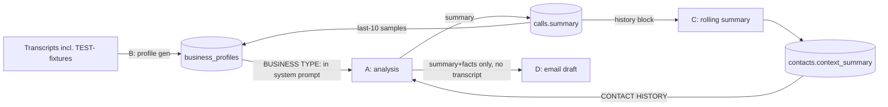

# LLM Prompt Contamination — Investigation & Root Cause

**Status:** investigation complete; fixes implemented on `fix/llm-prompt-contamination`.
**Trigger:** a real voicemail produced a Gmail draft referencing **"Streamline
Software"** and a conversation that never occurred. Infrastructure was healthy.

---

## 1. Every LLM call site and every input it receives

There are **four** Claude call sites (five before this branch — the email
drafter existed as two drifted copies). Each API call is **stateless**: no
conversation memory, no server-side prompt cache, no few-shot message arrays.
Every piece of prompt text comes from one of the sources below.

### Call site A — call analysis (`services/analyse.js`)
| Input | Origin | Contamination risk |
|---|---|---|
| System prompt template | Hard-coded in `analyse.js:34-65` | Static; includes generic label examples ("Send quote") |
| `BUSINESS TYPE: …` + `profile_summary` | **DB: `business_profiles` row — a cached prior Claude output** | ⚠️ HIGH — see loop L1 |
| `extraction_fields` w/ `Example: "…"` lines | Same DB row (Claude-generated examples) | ⚠️ HIGH — synthetic examples injected as prompt text |
| `CONTACT HISTORY` block | DB: `contacts.context_summary` (cached Claude output) + last-3 `calls.summary` (Claude outputs) | ⚠️ HIGH — see loops L2/L3 |
| User message | `transcript` (Deepgram, verbatim) | Clean — ground truth |

### Call site B — business profile generation (`services/business-profile.js:60-105`)
| Input | Origin | Risk |
|---|---|---|
| System prompt | Hard-coded | Static |
| User message | **Last 10 `status='complete'` calls' transcripts for the client — including `TEST-…` rows** | ⚠️ CRITICAL — test fixtures enter here |

### Call site C — rolling contact summary (`services/contacts.js:93-136`)
| Input | Origin | Risk |
|---|---|---|
| `EXISTING SUMMARY` | DB: previous Claude output | ⚠️ self-reinforcing (L2) |
| `RECENT CALLS` | `calls.summary` rows (Claude outputs; **TEST- rows not excluded**) | ⚠️ |
| `LATEST CALL SUMMARY` / `KEY FACTS` | Current analysis (A) output / merged `contacts.facts` | inherits A's contamination |

### Call site D — email draft (`routes/recording.js:271-283`; drifted copy in `routes/test.js:115-142`)
| Input | Origin | Risk |
|---|---|---|
| System prompt | Hard-coded: *"a client they just spoke with on the phone… refer to specifics from the call (dates, prices, **what was agreed**)"* | ⚠️ CRITICAL — asserts a two-way conversation happened; v1 recordings are **voicemails** |
| `call summary` | Analysis (A) output — NOT the transcript | ⚠️ the draft never sees ground truth |
| `Key facts` | `analysis.facts` | inherits A |
| Fallback body / subject | Hard-coded: **"Great speaking with you today"** | ⚠️ hidden default that fabricates a conversation even when Claude returns nothing |

**Sources that do NOT exist** (checked): developer prompts, few-shot message
arrays, manual prompt injection points, client_settings text in prompts,
server-side prompt caches, cross-request conversation memory.

## 2. The three feedback loops (the systemic finding)

Claude output is persisted and recycled as future Claude *input* in three
places — so contamination doesn't decay, it compounds:

- **L1 (profile loop):** transcripts → profile → analysis system prompt → summaries → future profile regeneration.
- **L2 (contact loop):** summaries → rolling summary → next analysis's context → next summary.
- **L3 (draft blindness):** the drafter sees only L1/L2-derived text, never the transcript — it cannot distinguish evidence from accumulated fiction.

## 3. Root cause determination

**"Streamline Software" is the demo test fixture.** It exists in exactly one
place in the repo: `public/index.html:1712-1734` — synthetic *answered-call*
demo transcripts ("Speaker 0: Streamline Software, Alex speaking") used by the
dashboard's inject-batch feature. The chain:

1. Demo batch → `POST /test/inject` → **saved as real completed calls**
   (`status:'complete'`, `client_id:'default'`, `call_sid:'TEST-…'`,
   `test.js:66-87`) and fed into `updateContactFromCall` (contacts poisoned).
2. `generateBusinessProfile` sampled the last 10 completed calls **with no
   TEST- exclusion** → Claude correctly concluded "this business is Streamline
   Software, a software company" → **cached in `business_profiles`**.
3. Every subsequent real call's analysis ran with
   `BUSINESS TYPE: … Streamline Software …` in its **system prompt**, plus
   software-sales `extraction_fields` examples.
4. The email drafter then received that skewed summary — under a system prompt
   asserting a conversation happened and demanding "what was agreed," with no
   transcript to push back — and the hard-coded subject/fallback "Great
   speaking with you today" completed the fiction.

### Verdict per suspect category

| Suspect | Verdict |
|---|---|
| Test fixtures | **PRIMARY CAUSE** — demo batch persisted as real data via `/test/inject` |
| Cached data | **PRIMARY AMPLIFIER** — `business_profiles` + `contacts.context_summary` are cached LLM outputs recycled into prompts (loops L1/L2) |
| Stale prompt template | **PRIMARY CAUSE (conversation fiction)** — drafter template assumes an answered call; v1 records voicemails only |
| Hidden defaults | **CONFIRMED** — "Great speaking with you today" subject + fallback body |
| Prompt assembly bug | **CONFIRMED (by omission)** — drafter never receives the transcript; grounding impossible |
| Few-shot / synthetic examples | **CONTRIBUTING** — profile `extraction_fields` "Example:" strings are Claude-invented text injected into A's system prompt |
| Database data | Conduit (calls/contacts rows), not origin |
| Manual injections, client settings, string-concat bugs, prompt caches, conversation memory | **RULED OUT** — none exist in the code paths |
| Claude behaviour | Downstream symptom. Given "a client you just spoke with," "what was agreed," and no transcript, fabrication is the *instructed* outcome. |

## 4. Persistence warning (why code fixes alone are insufficient)

The contamination lives in the **database**, not just prompts:
`business_profiles` for `default`, `contacts` rows/`context_summary` for demo
numbers, and `TEST-…` rows in `calls`. Cleanup script (reviewed, not run):
[`../supabase/sql/cleanup_test_contamination.sql`](../supabase/sql/cleanup_test_contamination.sql).
Until applied, the profile row keeps re-injecting Streamline Software even
with the new prompts (they now instruct against it, but removing the source
is the real fix).

## 5. The fix (implemented on this branch)

Single-responsibility prompt architecture in `src/services/prompts.js` (pure,
testable): analysis/extraction, business profile, rolling summary, email
drafting, calendar gating — each with explicit grounding rules; email drafting
is **mode-aware** (`voicemail` / `answered` / callback / appointment sub-modes)
and receives the **transcript verbatim** as its evidence base. A deterministic
post-generation guard (`src/services/draft-guard.js`) rejects drafts containing
entities/dates unsupported by the transcript, falling back to a safe
non-fabricating template. `/test/inject` data is excluded from profile
generation and contact history. Regression tests cover the six required
scenarios and fail on hallucinated companies/people/appointments/products.
See commits on this branch for the unit-by-unit breakdown.
