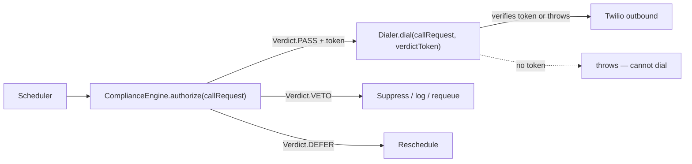

# Outbound BDM — Compliance-as-Code Reference Architecture

_Companion to [OUTBOUND_BDM_ARCHITECTURE.md](OUTBOUND_BDM_ARCHITECTURE.md). That
document defines **which** compliance gates exist and **why** (Australian law,
§2/§5). This one specifies the **reusable engine** that enforces them — the
interfaces, the enforcement choke point, and the evidence model — so
implementation is a matter of writing gates against a stable contract, not
hand-rolling checks per campaign._

> **Design goal (from the task):** every outbound call passes through compliance
> gates before it is dialled, and the enforcement is *reusable architecture*, not
> per-campaign scripts. The mechanism below makes an unlawful dial require the
> failure of the engine itself, not of any single gate or any caller remembering
> to check.

---

## 1. The one rule that makes it "as code"

> **There is exactly one function in the system that can cause an outbound dial,
> and it refuses to dial without a valid `ComplianceVerdict` for that specific
> call.** No other code path reaches Twilio's outbound API. This single choke
> point is what turns "policy" into "code": you cannot dial by forgetting to
> check, because dialling *is* checking.



The dialer validates the verdict token (bound to the call's id + a hash of the
request) and **throws** if it's missing, mismatched, or stale. A developer cannot
accidentally write a code path that dials without a verdict, because the dialer's
only entry point demands one.

## 2. Core interfaces

Expressed in TypeScript for precision; the codebase is CommonJS JS, so these
become JSDoc-typed modules. Names are normative.

```ts
type Pipeline = "warm" | "cold";
type Decision = "PASS" | "VETO" | "DEFER";

interface CallRequest {
  id: string;                 // stable, unique — the audit correlation id
  clientId: string;           // tenant slug
  campaignId: string;
  pipeline: Pipeline;
  contact: {
    phone: string;            // E.164
    timezone: string;         // recipient-local — a compliance input, not UX
    lawfulBasis?: string;     // declared basis (existing-customer / express / washed-cold)
  };
  attemptNumber: number;
  now: Date;                  // injected — never read the clock inside a gate (testability)
}

interface GateResult {
  gate: string;               // stable id, e.g. "dnc-scrub"
  decision: Decision;
  reason: string;             // human-readable, stored as evidence
  evidence?: Record<string, unknown>; // structured proof (scrub timestamp, etc.)
  deferUntil?: Date;          // only for DEFER
}

interface ComplianceGate {
  id: string;
  appliesTo(pipeline: Pipeline): boolean;   // e.g. DNC scrub is mandatory for cold
  mandatory: boolean;                        // mandatory gates cannot be config-disabled
  evaluate(req: CallRequest, ctx: GateContext): Promise<GateResult>;
}
```

Design constraints baked into the types:

- **`now` is injected**, never read via `Date.now()` inside a gate. Calling-hours
  and scrub-freshness gates are therefore deterministically testable against a
  frozen clock.
- **`mandatory` gates cannot be disabled by client/campaign config.** The config
  layer can only *add* stricter gates or tune *optional* ones (§5 of the strategy
  doc). A config file can never remove a DNC scrub.
- **Evidence is structured**, not a log string — it's the artifact a regulator
  complaint (failure mode F10) is answered with.

## 3. The engine

```ts
interface ComplianceVerdict {
  callRequestId: string;
  decision: Decision;         // PASS only if ALL applicable gates passed
  token?: string;             // HMAC(callRequestId + requestHash), required by the dialer
  gateResults: GateResult[];  // every gate that ran, in order
  deferUntil?: Date;
}

class ComplianceEngine {
  constructor(
    private gates: ComplianceGate[],       // ordered; see gate registry §4
    private evidence: EvidenceStore,
    private clock: Clock,
  ) {}

  async authorize(req: CallRequest, ctx: GateContext): Promise<ComplianceVerdict> {
    const applicable = this.gates.filter(g => g.appliesTo(req.pipeline));
    const results: GateResult[] = [];

    for (const gate of applicable) {
      let result: GateResult;
      try {
        result = await gate.evaluate(req, ctx);
      } catch (err) {
        // FAIL CLOSED: a throwing gate is a VETO, never a skip.
        result = { gate: gate.id, decision: "VETO", reason: `gate error: ${err.message}` };
      }

      // Evidence is written for EVERY gate decision, BEFORE we proceed.
      await this.evidence.record(req, result);
      results.push(result);

      if (result.decision === "VETO") {
        return { callRequestId: req.id, decision: "VETO", gateResults: results };
      }
      if (result.decision === "DEFER") {
        return { callRequestId: req.id, decision: "DEFER", deferUntil: result.deferUntil, gateResults: results };
      }
    }

    // All applicable gates passed → mint the dialer token.
    const token = this.mintToken(req);
    await this.evidence.record(req, { gate: "engine", decision: "PASS", reason: "all gates passed" });
    return { callRequestId: req.id, decision: "PASS", token, gateResults: results };
  }
}
```

Properties this guarantees, by construction:

1. **Default-deny.** The loop only reaches `PASS` if *every* applicable gate
   returned `PASS`. A missing gate result, a thrown error, or a `VETO` all stop it.
2. **Fail-closed.** A gate that throws is treated as a `VETO`, never skipped. A bug
   in a gate cannot open the door — it closes it.
3. **Evidence-before-action.** `evidence.record(...)` is `await`ed before the next
   gate and before minting the token. If the evidence store is unavailable, the
   `record` call throws → caught as VETO → **no dial** (the "no evidence, no call"
   rule from the strategy doc's G17).
4. **Short-circuit on VETO** — but every gate up to the veto is still recorded, so
   the audit trail shows exactly where and why a call was stopped.

## 4. Gate registry (config, per pipeline)

Gates are registered in an **ordered** list per pipeline. Ordering runs cheap,
high-signal gates first (opt-out, kill switch) so expensive checks (DNC API) only
run for calls still in contention. The registry is data, not code — new gates
plug in without touching the engine.

```ts
const WARM_GATES = [killSwitch, optOut, blacklist, dedupe, recentContact,
                    maxAttempts, callingHours, runtimeRevalidation];

const COLD_GATES = [killSwitch, optOut, blacklist, campaignApproval, dncScrub,
                    scrubFreshness, dedupe, recentContact, maxAttempts,
                    callingHours, runtimeRevalidation];
//                  ^ cold carries the full set; warm cannot borrow cold's relaxations
//                    and cold cannot drop a mandatory gate (enforced by `mandatory`).
```

The mapping of gate → mandatory/optional and → pipeline is the machine-readable
form of the strategy doc's §5 table. That table and this registry must not drift —
**the registry is the source of truth once built; the table documents it.**

## 5. The runtime-revalidation gate (why it's last)

`runtimeRevalidation` re-runs the freshness-sensitive checks (DNC wash age,
opt-out, calling-hours, attempt cap) against **live** data, immediately before the
token is minted. It exists because everything upstream — queueing, scheduling —
can go stale between decision and dial (a number opted out five minutes ago; the
wash crossed 30 days overnight). It treats all prior gate results as untrusted.

This is the redundancy that makes the design survive its own bugs: even if a
scheduling bug released a stale batch, the last gate re-checks reality and vetoes.

## 6. Evidence store contract

```ts
interface EvidenceStore {
  // Append-only. MUST be durable before returning. MUST NOT update-in-place.
  record(req: CallRequest, result: GateResult | EngineResult): Promise<void>;
}
```

- **Append-only, write-once.** Backed by an insert-only table (`compliance_log` in
  the BDM data model). No updates, no deletes — an audit trail you can amend is not
  an audit trail.
- **On the critical path.** A failed write must fail the authorization (see engine
  property 3). This is a deliberate throughput/safety trade: if evidence can't keep
  up, dialling slows — the correct failure direction.
- **Correlation id** = `CallRequest.id`, tying every gate decision, the verdict,
  the dial attempt, the recording, and the outcome into one reconstructable story
  (answers failure mode F10's "assemble the evidence pack").

## 7. Kill switch as both a gate and an out-of-band control

The kill switch appears **first** in every registry (so a tripped switch vetoes
before any work) *and* is enforced out-of-band: an engaged switch also drains the
scheduler and cancels in-flight authorizations. Two mechanisms, one intent — a
single call to disable cold platform-wide, human- or monitor-triggerable, that
takes effect in seconds.

## 8. Testing the engine (the compliance oracle)

Because gates are pure-ish (inputs + injected `now`/`ctx`, no ambient clock), the
engine is unit-testable as a **compliance oracle**:

- Each gate has table-driven tests: (input, frozen clock, ctx) → expected decision.
- The engine has adversarial tests: a throwing gate ⇒ VETO; an unavailable evidence
  store ⇒ VETO; a stale runtime check ⇒ VETO; a DEFER short-circuits.
- **Golden legal scenarios** (from Phase 0 counsel sign-off) become fixtures: "a
  number on the DNC register with no basis" ⇒ VETO with `dnc-scrub` evidence;
  "Sunday 10am" ⇒ VETO with `calling-hours` evidence; etc. These fixtures are the
  executable form of the legal advice and must be updated when the law changes.

## 9. How this maps to the existing Aida codebase

- The engine and gates are a **new, isolated module** (`src/services/compliance/`
  in a future build) — they do not touch inbound call routing, and reuse the
  existing tenant-scoping (`clientId`) and Supabase patterns.
- The dialer is a new outbound module behind the engine; it is the **only** caller
  of Twilio's outbound API for the BDM (distinct from `routes/call.js`, which is
  the operator's single-tenant outbound and is itself a loop hazard flagged for
  VoIP — see [VOIP_V2_ARCHITECTURE.md](VOIP_V2_ARCHITECTURE.md) INV-1).
- Evidence store = a new append-only Supabase table; RLS-scoped like the rest.

---

_This is design, not implementation. Building it is gated on Phase 0 legal
sign-off (see OUTBOUND_BDM_ARCHITECTURE.md §14) — the golden legal scenarios in §8
cannot be written until counsel defines them._
