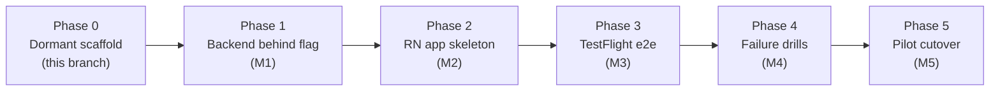

# VoIP v2 — Implementation Plan

**Status:** planning approved for Phase 0 only · **Owns:** sequencing, gates,
and the decisions that resolve open questions from the architecture doc.
**Companions:** [VOIP_V2_ARCHITECTURE.md](VOIP_V2_ARCHITECTURE.md) (the design
and its rationale — D1–D6, INV-1–6, §11 call flow),
[VOIP_V2_PRODUCTION_OPS.md](VOIP_V2_PRODUCTION_OPS.md) (cost/SLO/monitoring),
[VOIP_V2_BACKEND_SPEC.md](VOIP_V2_BACKEND_SPEC.md),
[VOIP_V2_MOBILE_APP_SPEC.md](VOIP_V2_MOBILE_APP_SPEC.md),
[VOIP_V2_PHASE_0_SCAFFOLD.md](VOIP_V2_PHASE_0_SCAFFOLD.md).

> **Prime directive (unchanged from the architecture doc):** the v1 missed-call
> pipeline must not break. Every phase below is additive, per-client opt-in,
> and reversible without a deploy (carrier codes + `voip_enabled=false`).

---

## 1. Reality check — what changed since the architecture doc was written

The architecture doc and SECURITY_REVIEW were written against commit `1cdeaaa`.
Two facts they state are now stale; this plan supersedes them:

| Doc says | Reality (2026-07-06) |
|---|---|
| "RLS is currently disabled" | **RLS is applied** (deny-by-default, no policies) on all seven base tables. New tables must be born with RLS — see D8. |
| `personal_contacts` referenced as working | Table was missing; created 2026-07-06 with RLS + unique constraint. The pre-dial `isPersonalCall()` check in §11 now works for real. |
| `ENCRYPTION_KEY` fail-open footgun open | Fixed on `hardening/p0-autonomous` (fail-closed + startup validation). **Deploy precondition:** key must be set ≥32 chars in Railway. |

## 2. Decisions settled by this plan (D7–D12)

These resolve the gaps/contradictions the doc audit surfaced. Numbering
continues the architecture doc's D1–D6.

| # | Decision | Rationale |
|---|---|---|
| **D7** | **Two-level gating.** Server-wide `VOIP_V2_ENABLED` env flag (kill switch, default **false**) AND per-client `clients.voip_enabled` (default false). Any VoIP code path requires both. | A server-wide off switch that needs no DB access lets us ship dormant code safely and kill the feature in one Railway var if anything goes wrong — same rollback philosophy as the §16 runbook. |
| **D8** | **`devices` is born with RLS enabled** in the same transaction that creates it, unique/index constraints included. | The `personal_contacts` incident set the precedent: no table may be created unprotected. Non-negotiable. |
| **D9** | **Conditional fail-closed config.** `TWILIO_API_KEY_SID/SECRET` and push-credential SIDs are validated at startup and **fatal only when `VOIP_V2_ENABLED=true`**; when false they are not even warned about. | Extends the P0-2 fail-closed pattern to the new secret class without adding noise or breaking today's deploys. |
| **D10** | **INV-1 sources `clients.real_number`, never `CLIENT_REAL_NUMBER` env.** Implementing the loop guard includes fixing backlog P2-5 for `/call/initiate` (dial target and guard both come from the client row). | Guarding against the env var would "work" only in the single-tenant world — the guard must be per-tenant correct or it is a false safety. Numbers are compared E.164-normalised (same helper as owner recognition). |
| **D11** | **Rate limiting ships with the first real VoIP endpoints.** `/voice/token` and `/devices/register` get a simple per-session/per-IP throttle at MVP. | They are the new low-cost brute-force surface; SECURITY_REVIEW open risk #2 must not grow. |
| **D12** | **Monitoring split.** MVP: server-side structured logs + push-ack receipt endpoint (the funnel metric PRODUCTION_OPS §4 says cannot be bought) + a daily staleness/answer-rate query. V2: dashboards/alerts UI. | Resolves the architecture doc's internal contradiction (Q10 defers monitoring to V2, but F1/F9 detection depends on it). Detection is MVP; presentation is V2. |

Also affirmed, not changed: D1–D6, INV-1–6, iOS-first-unless-pilot-is-Android
(Q2), TTL 1h Access Tokens, hash-only push tokens.

## 3. Blocking prerequisites (nothing in Phase 2+ starts until these clear)

| # | Prerequisite | Why it blocks | Status |
|---|---|---|---|
| B1 | **Client session refresh** (Phase 5 item 5): sessions die ~1h. | An app that logs out hourly cannot hold a trustworthy registration; `/voice/token` refresh depends on a durable session. Architecture doc calls this "a blocking prerequisite, not a nice-to-have." | Open. Must land before app development (Phase 2/M2). |
| B2 | **Legal answer on AU two-party recording consent** (Q1). | v2 records live conversations — a materially different consent posture than v1 voicemail under AU state surveillance-devices laws. | Open. Blocks pilot cutover (Phase 5/M5), not code. Get advice early; if an announcement is required it changes §11 TwiML. |
| B3 | **Carrier CFU test** (Q3): `*21*` behaviour, caller-ID preservation, `*#21#` support, forwarding charges on the pilot's carrier/MVNO. | The whole delivery model assumes CFU works as documented on the pilot's SIM. | Open. $2-SIM test; blocks cutover planning, informs cost model (Q4). |
| B4 | **`hardening/p0-autonomous` deployed** (ENCRYPTION_KEY precondition met). | Phase 0 scaffold branches from it; the fail-closed config pattern D9 builds on ships there. | Branch ready, not deployed. |
| B5 | **Pilot client #1 identified** → settles MVP platform (Q2). | iOS vs Android decides which half of the mobile spec executes first. | Open. |

## 4. Phase plan

Phases map to the architecture doc's M1–M5 but add **Phase 0** (what this
branch does) and split backend from app. Each phase has an entry gate, an exit
gate, and touches production only where stated.

### Phase 0 — dormant scaffold *(this branch; the only phase with code today)*
- `VOIP_V2_ENABLED` flag (default false), placeholder routes returning 501 when
  enabled / passing through untouched when disabled, conditional startup
  validation (D9), unit tests, these four documents.
- **No Twilio routing change, no SQL, no deploy, no real VoIP logic.**
- Exit gate: `npm test` green, all placeholder behaviour proven flag-gated,
  docs indexed. Details: [VOIP_V2_PHASE_0_SCAFFOLD.md](VOIP_V2_PHASE_0_SCAFFOLD.md).

### Phase 1 — backend behind the flag (M1)
- Entry gate: B4 (hardening branch deployed); `devices` DDL reviewed.
- Implement per [VOIP_V2_BACKEND_SPEC.md](VOIP_V2_BACKEND_SPEC.md): `devices`
  table (D8), `/voice/token`, `/devices/*`, `/voip/dial-result`,
  `/voip/call-status`, `/voip/push-ack`, identity helper (INV-6), INV-1 guard
  in `call.js` (D10), INV-5 tripwire, rate limiting (D11), the `inbound.js`
  branch + shared voicemail-TwiML helper — all inert unless **both** D7 flags
  are true, which no production client has.
- Exit gate: unit + integration tests green; with flags off, production
  behaviour byte-identical (smoke suite proves it); with flags on in a dev
  environment, a Twilio softphone/test Client can be dialled.

### Phase 2 — React Native app skeleton (M2)
- Entry gate: **B1 (session refresh) landed**; B5 (platform decided).
- Per [VOIP_V2_MOBILE_APP_SPEC.md](VOIP_V2_MOBILE_APP_SPEC.md): login, token
  fetch, SDK registration, CallKit/ConnectionService answer path, push-ack.
- Exit gate: dev-environment answered call rings a real device.

### Phase 3 — TestFlight end-to-end (M3)
- Entry gate: Phase 2 exit; Apple/Play accounts + push credentials configured
  (change-controlled per F7).
- Exit gate: §15 MVP acceptance criteria 1–4 pass on a physical device.

### Phase 4 — failure drills (M4)
- Every §11 failure branch exercised deliberately (decline, airplane mode,
  force-stop, token expiry, double-answer race F8, push-late F10).
- Exit gate: all drills terminate in v1 voicemail per INV-2; zero PSTN redials
  observed; funnel metrics (D12) captured for each drill.

### Phase 5 — pilot cutover (M5)
- Entry gate: **B2 (legal) resolved**; B3 (carrier test) done; §16 runbook
  rehearsed including the two-minute rollback.
- Exit gate: pilot client live on CFU; §15 acceptance criteria 5–7 verified in
  production; rollback rehearsal documented.

## 5. What this repo will NOT do until gates pass

- No change to `*21*`/`**6x*` guidance given to any client (Twilio inbound
  routing untouched — Phase 0–1 don't alter what any live number does).
- No SQL applied from this branch (the `devices` DDL ships as a reviewed file,
  applied by a human like `create_personal_contacts.sql` was).
- No pushes/deploys as part of planning; Phase 1+ each deploy is its own
  reviewed step following DEPLOYMENT.md order.
- No App Store/Play submission work before Q11 (listing identity) is decided.

## 6. Risk register delta (what VoIP adds to today's posture)

| Risk | Phase it appears | Mitigation |
|---|---|---|
| Loop regression (PSTN dial to a CFU'd number) | 1+ | INV-1 guard (D10) + INV-5 tripwire + acceptance test "call/initiate refuses voip_enabled client" |
| New secret class (`TWILIO_API_KEY_SECRET`, push credential SIDs) mishandled | 1 | D9 conditional fail-closed startup validation; secrets only in Railway env, never repo |
| `devices` table data (device metadata per client) | 1 | D8 RLS-at-birth; hash-only push tokens; soft revocation + 30-day staleness cleanup |
| Token-mint abuse | 1 | Client-session auth + D11 rate limit + 1h TTL |
| Android delivery gap (force-stop, OEM killers) | 2+ | Honest degrade to voicemail (INV-2) + D12 funnel metric + onboarding allowlisting; iOS-first default |
| Consent/legal exposure for live-call recording | 5 | B2 hard gate before any real client cutover |
| Pipeline drop-on-outage (backlog P1-5) now also affects answered calls | 5 | Unchanged exposure class, higher stakes; schedule P1-5 retry/queue work before scaling past pilot |

## 7. Open questions this plan does NOT settle

Q1 (legal), Q3 (carrier), Q4 (verified cost model), Q7 (dual-SIM UX), Q8
(customer-audible latency treatment — default pure ringback stands), Q9
(call-waiting policy), Q11 (store identity), Q12 (fate of the `isYou` DTMF
bridge at cutover — recommendation: keep it until app-originated outbound
ships in V2, then retire; `routes/outbound.js` is independent and follows the
existing backlog investigation), Q6 (app repo location — recommendation:
separate repo, since the server deploys from this repo's root on Railway and a
React Native tree would bloat every deploy; final call at Phase 2 entry).
